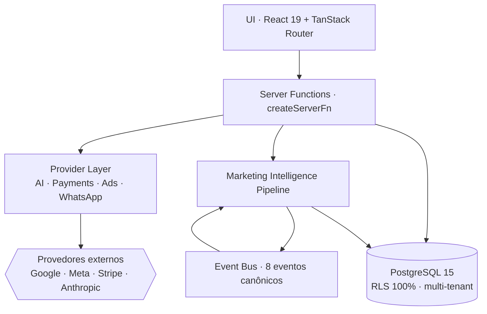
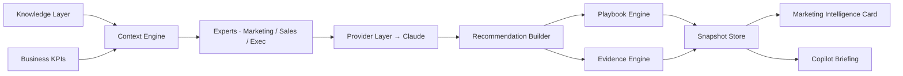
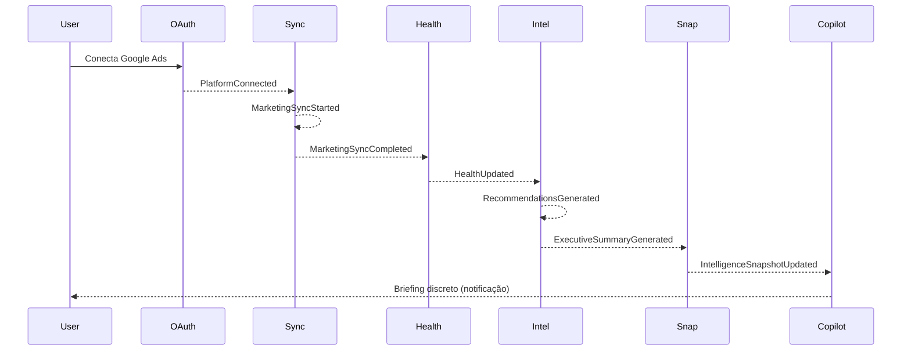
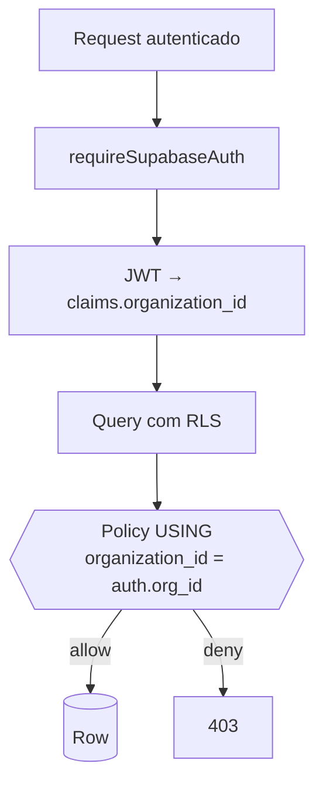
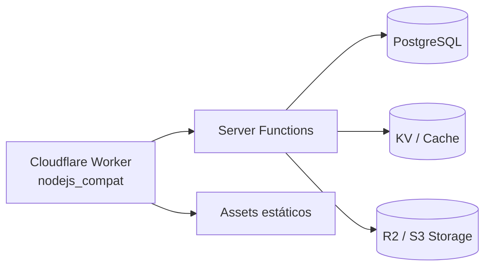

# Diagramas — Zenno AI Suite

Todos os diagramas em Mermaid (renderizado nativamente pelo GitHub).

---

## 1. Arquitetura em camadas

---

## 2. Marketing Intelligence Pipeline

---

## 3. Event Bus canônico

---

## 4. Segurança / Multi-tenant

---

## 5. First Five Minutes (TTFI)

```mermaid
gantt
  title Time To First Intelligence (TTFI)
  dateFormat  X
  axisFormat  %s

  section Onboarding
  OAuth Google           :a1, 0, 10
  Discovery Assets       :a2, after a1, 15
  Primeiro Sync          :a3, after a2, 45
  Health + Intelligence  :a4, after a3, 30
  Snapshot + Briefing    :a5, after a4, 10
```

Meta: TTFI ≤ 5 minutos.

---

## 6. Runtime alvo (Workers)

